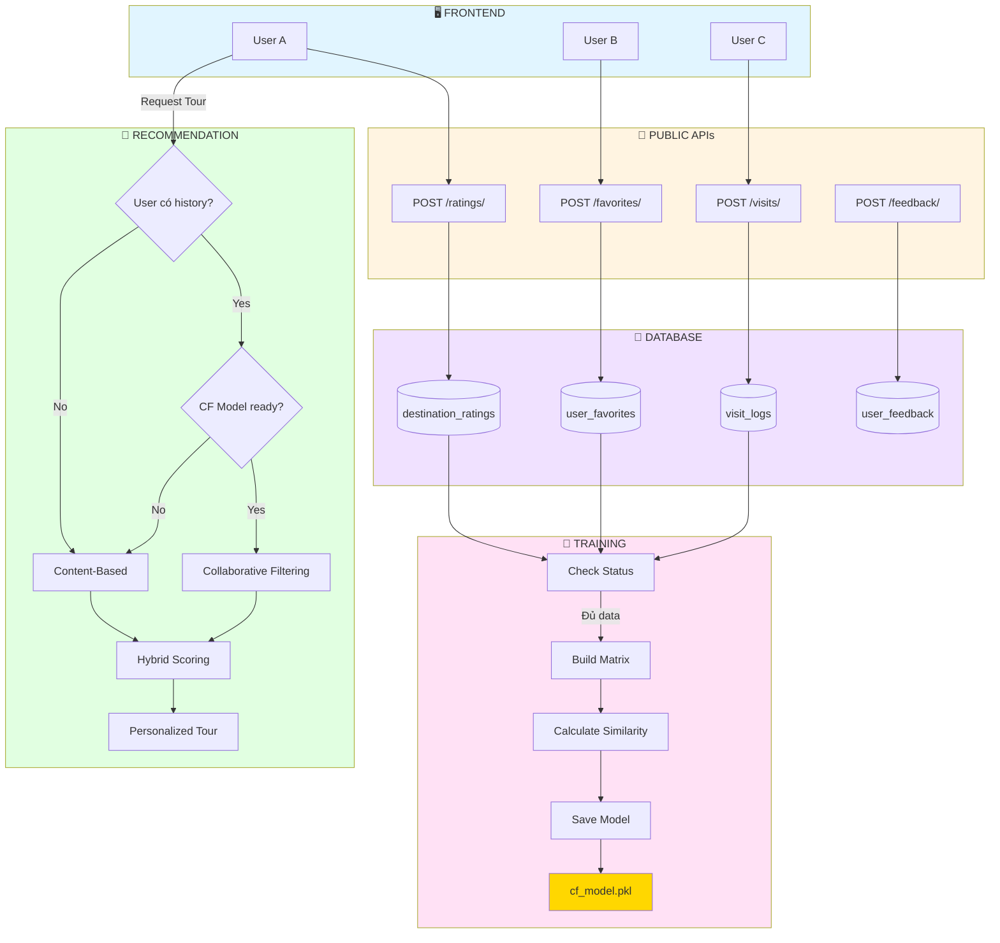
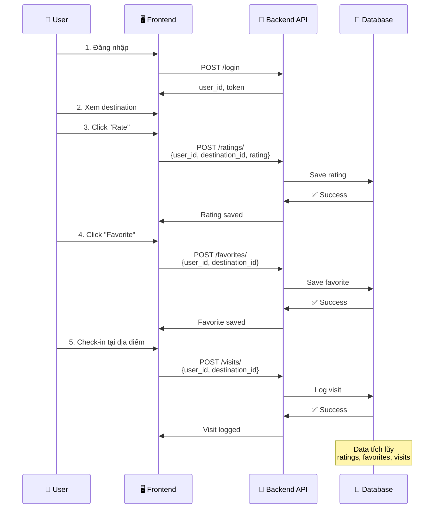
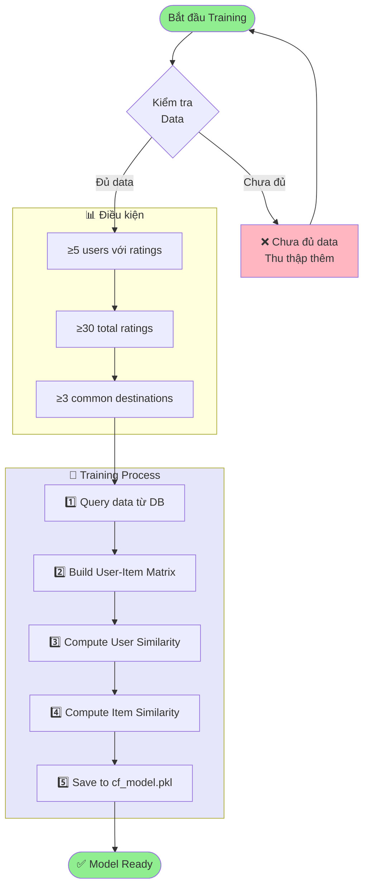
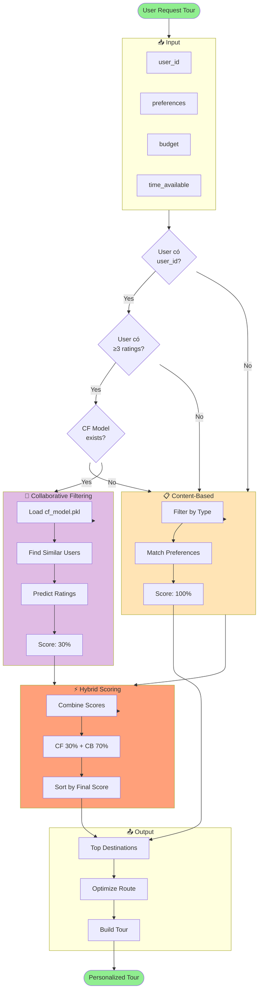
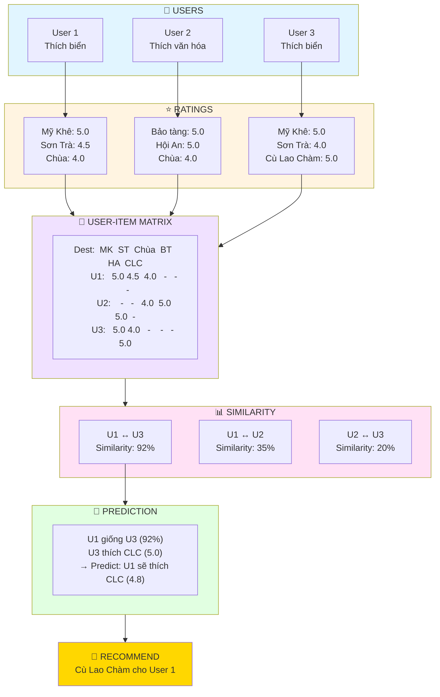
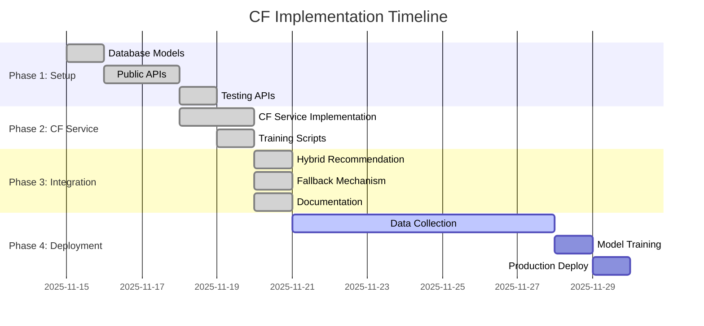
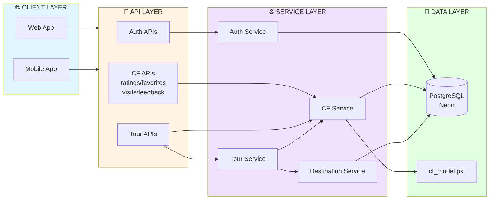

# 📊 SƠ ĐỒ LUỒNG COLLABORATIVE FILTERING

## Sơ Đồ 1: Tổng Quan Hệ Thống

---

## Sơ Đồ 2: Luồng Thu Thập Dữ Liệu

---

## Sơ Đồ 3: Luồng Training CF Model

---

## Sơ Đồ 4: Luồng Hybrid Recommendation

---

## Sơ Đồ 5: Cách CF Tìm Similar Users

---

## Sơ Đồ 6: Timeline Implementation

---

## Sơ Đồ 7: Architecture Overview

---

## 🎨 Hướng Dẫn Sử Dụng Trong Slide

### Cách 1: Render trực tiếp (GitHub, Notion, GitLab)
- Copy code Mermaid vào markdown
- Tự động render thành diagram

### Cách 2: Export sang hình ảnh

**Online Tools:**
1. **Mermaid Live Editor**: https://mermaid.live/
   - Paste code Mermaid
   - Click "Download PNG" hoặc "Download SVG"

2. **Diagrams.net (draw.io)**: https://app.diagrams.net/
   - Import Mermaid code
   - Export PNG/SVG

3. **VS Code Extension**:
   - Install "Markdown Preview Mermaid Support"
   - Right-click diagram → Export to PNG

### Cách 3: Screenshot
- Render diagram trong GitHub/Notion
- Screenshot và crop

---

## 📋 Checklist Cho Slide

- [ ] **Slide 1**: Sơ đồ 1 - Tổng quan hệ thống
- [ ] **Slide 2**: Sơ đồ 2 - Luồng thu thập dữ liệu
- [ ] **Slide 3**: Sơ đồ 5 - Cách CF tìm similar users (ví dụ)
- [ ] **Slide 4**: Sơ đồ 4 - Luồng Hybrid Recommendation
- [ ] **Slide 5**: Sơ đồ 7 - Architecture overview

---

## 💡 Tips Cho Presentation

1. **Bắt đầu với Sơ đồ 5** (Similar Users) - dễ hiểu nhất
2. **Sau đó Sơ đồ 1** (Tổng quan) - big picture
3. **Chi tiết với Sơ đồ 4** (Hybrid) - implementation
4. **Kết với Sơ đồ 7** (Architecture) - technical depth

**Animation suggestions:**
- Highlight từng bước trong flow
- Màu sắc đã được set sẵn cho từng layer
- Focus vào arrows để show data flow

---

**Chúc bạn thuyết trình thành công với những diagram đẹp! 🎨🚀**
